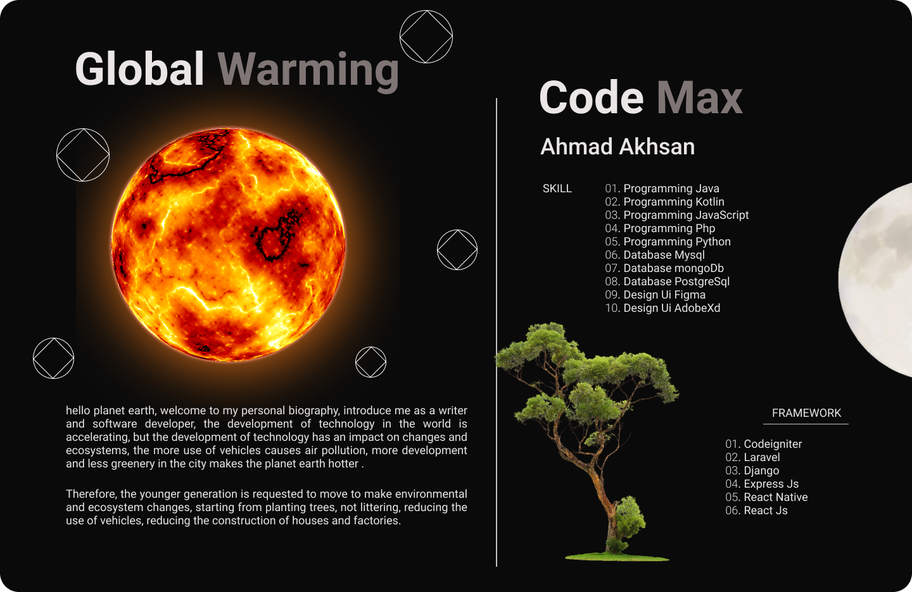

### Hi there 👋

  
welcome to my github, I am a developer, I have examples of several projects that I made, for self-development focus on problem solving, while my project examples vary, ranging from sales applications, cashier applications, financial applications, to see examples of code programs you can seen below, I also receive some input using other people's code and want to collaborate, learn knowledge together 

<h6> Biodata </h6>

<!--
**ahmadakhsan/ahmadakhsan** is a ✨ _special_ ✨ repository because its `README.md` (this file) appears on your GitHub profile.

width="200" style="max-width:100%;"
Here are some ideas to get you started:

- 🔭 I’m currently working on ...
- 🌱 I’m currently learning ...
- 👯 I’m looking to collaborate on ...
- 🤔 I’m looking for help with ...
- 💬 Ask me about ...
- 📫 How to reach me: ...
- 😄 Pronouns: ...
- ⚡ Fun fact: ...
-->
