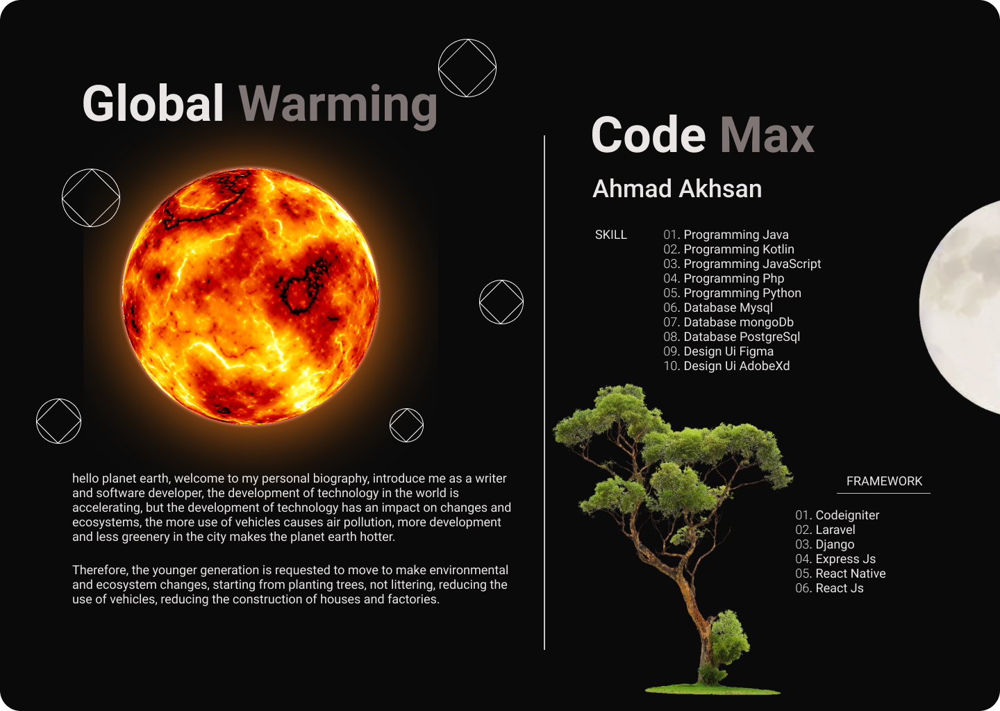

### Hi there 👋

selamat datang

  
  

    <h5 class="card-title">Card title</h5>
    
Some quick example text to build on the card title and make up the bulk of the card's content.

    <a href="#" class="btn btn-primary">Go somewhere</a>
  

<!--
**ahmadakhsan/ahmadakhsan** is a ✨ _special_ ✨ repository because its `README.md` (this file) appears on your GitHub profile.

Here are some ideas to get you started:

- 🔭 I’m currently working on ...
- 🌱 I’m currently learning ...
- 👯 I’m looking to collaborate on ...
- 🤔 I’m looking for help with ...
- 💬 Ask me about ...
- 📫 How to reach me: ...
- 😄 Pronouns: ...
- ⚡ Fun fact: ...
-->
